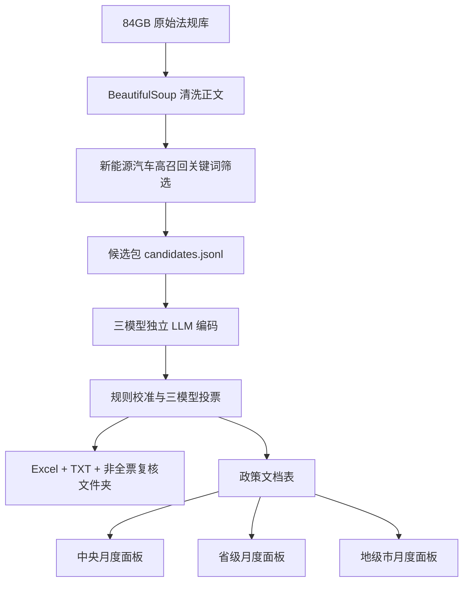

# 新能源汽车产业政策完整工作流流程细节报告

更新时间：2026-06-10

## 1. 目标

本工作流的目标是从 84GB 法规库中识别新能源汽车相关政策，再进一步判断其中哪些属于 Fang, Li, and Lu (2025) *Decoding China's Industrial Policies* 窄口径下的产业政策，并对产业政策工具、政策方向、事前/事后、供给/需求、支持/限制、强度、覆盖广度和行政层级进行结构化编码，最终形成月度面板数据。

当前输出不再把中央和省级政策强行摊到所有地级市，而是生成三套来源层级面板：

- 中央政策月度面板：中央/国家层面政策单独统计。
- 省级政策月度面板：省级政策按省-月统计。
- 地级市政策月度面板：地级市/地方政策按市-月统计。

旧版“影响城市扩展表”和“城市月度面板”仍保留，主要用于兼容和人工检查。

## 2. 输入数据

原始全量法规库：

```text
法律法规文件库.json
```

已完成 BeautifulSoup/关键词筛选的新能源汽车候选包：

```text
outputs/policy_packages/new_energy_vehicle/candidates.jsonl
```

当前候选数量：

```text
59,819
```

候选包只含已经筛出的新能源汽车相关候选，约 511MB。因此后续 LLM 分类不需要重新扫描 84GB 原始库。

## 3. 总体流程



## 4. 初筛逻辑

初筛脚本：

```text
scripts/screen_related_policy_packages.py
```

新能源汽车候选筛选说明：

```text
docs/新能源汽车候选筛选逻辑说明.md
```

核心逻辑：

- 使用 BeautifulSoup 从 HTML 字段中提取纯文本。
- 结合强新能源汽车词、弱词组合模式、政策语境词打分。
- 只保留达到阈值的政策候选。
- 初筛只负责高召回地找“新能源汽车相关候选”，不判断是否为产业政策。

新能源汽车强词包括：

```text
新能源汽车、新能源车、纯电动汽车、插电式混合动力、燃料电池汽车、动力电池、车用动力电池、充电桩、充换电、换电站、充电基础设施、电动公交、电动出租、电动物流车、智能网联汽车
```

弱词组合用于捕捉“新能源 + 车”“充换电 + 车辆”“电池 + 车用/动力”等上下文。

## 5. LLM Prompt 口径

主脚本：

```text
scripts/nev_policy_pipeline.py
```

当前支持两种 prompt 模式：

```text
--prompt-mode standard
--prompt-mode adversarial
```

生产建议使用：

```text
--prompt-mode standard
```

含义：三模型独立结构化判断，不做第二轮对抗、辩论或互相说服。每个模型独立返回 JSON，脚本进行规则校准和投票。

`adversarial` 模式仍保留，用于边界样本研究，但不作为当前最快生产流程的默认方式。

## 6. 产业政策定义

产业政策判断采用 Fang, Li, and Lu (2025) *Decoding China's Industrial Policies* 的窄口径定义。

一条政策必须同时满足：

| 条件 | 含义 |
|---|---|
| 政府主体 | 政府、人大、部门、地方政府、开发区管委会等公共权力主体 |
| 措施或明确导向 | 可以是具体工具，也可以是正式规划/纲要/指导意见中的明确产业导向 |
| 直接偏向特定产业/活动 | 不能只是泛化宏观政策或间接受益 |
| 影响长期结构/资源配置 | 改变相对价格、准入、研发、投入、需求、供应链或监管约束 |

用户确认后，当前口径允许“导向型产业政策”：

```text
measure_specificity = guidance_only
```

例如正式规划、纲要、指导意见中把新能源汽车、动力电池、充换电基础设施等列为优先主题、重点方向、重点任务、重大工程、发展目标、技术路线或产业布局，即使没有补贴标准，也可以判为产业政策。

## 7. 关键排除规则

为提高一致率，脚本增加了规则校准层。以下情况通常强制排除：

- 人大/政协建议答复、提案答复、复函。
- 统计公报、年度报告、工作报告。
- 预算执行情况、预算草案、决算、预算决议。
- 国家标准公告、行业标准公告、地方标准公告、批量标准清单公告。
- 会议培训竞赛通知、工作分工、单纯名单/目录公告。
- 普通交通安全、消防、停车、限行管理。
- 一般环境治理、一般数字经济、智慧城市政策。

核心原则：不能把正文中引用的既有政策或工作成绩当作本文件出台的新能源汽车产业政策。

例子：

```text
已免征新能源汽车购置税/车船税
新能源汽车产销量增长
此前已支持充电桩建设
组织实施过新能源汽车重点专项
```

如果出现在答复、报告、预算、总结材料中，通常只是回顾或引用，不算本文件政策。

## 8. 智能网联与电池边界

`智能网联汽车` 只有在与新能源汽车、动力电池、车用氢能、充换电或新能源车示范应用直接绑定时才纳入。

不纳入：

- 单纯智慧城市基础设施与智能网联汽车协同试点。
- 单纯车联网、智慧交通、智能制造。
- 普通消费型锂电池。
- 普通车辆、普通充电、普通储能、电力系统充电安全。

## 9. 三模型策略

当前要求是“三模型，但先不对抗”。

三模型含义：

- 每条候选政策发送给三个模型。
- 三个模型独立输出结构化 JSON。
- 不进行第二轮模型互评、反驳或仲裁。
- 脚本按严格多数投票形成最终结论。
- 非全票样本单独放入复核文件夹。

本地测试模型：

```text
qwen3:4b-mirror
gemma3:4b-mirror
llama3.2:3b-mirror
```

云端可用模型：

```text
qwen3.5:cloud
gpt-oss:120b-cloud
glm-4.6:cloud
```

Ollama Pro 允许 3 个 cloud models 并发时，可使用：

```text
--parallel-models
```

本地小模型测试不建议打开并发，避免内存压力。

## 10. 输出字段

单条政策输出包括：

| 字段 | 含义 |
|---|---|
| `is_nev_related` | 是否新能源汽车相关 |
| `is_industrial_policy` | 是否产业政策 |
| `confidence_is_nev_related` | 新能源汽车相关置信度 |
| `confidence_is_industrial_policy` | 产业政策判断置信度 |
| `classification_confidence` | 综合置信度 |
| `policy_tone` | support / restrict / mixed / neutral / uncertain |
| `timing` | ex_ante / ex_post / mixed / uncertain |
| `policy_side` | supply / demand / both / ecosystem / uncertain |
| `measure_specificity` | guidance_only / specific_measures / mixed / uncertain |
| `policy_tools` | 20 类工具 ID |
| `tool_groups` | 5 大工具组 |
| `target_segments` | 目标环节 |
| `strength_score` | 政策强度，0-5 |
| `coverage_breadth_score` | 覆盖广度，0-5 |
| `direct_target_evidence` | 直接目标证据 |
| `measure_or_guidance_evidence` | 措施或导向证据 |

## 11. Decoding 工具分类

固定 20 类工具：

| 工具 ID | 工具组 |
|---|---|
| `credit_finance` | fiscal_financial |
| `tax_incentives` | fiscal_financial |
| `equity_support` | fiscal_financial |
| `fiscal_subsidies` | fiscal_financial |
| `industrial_fund` | entry_regulation |
| `promote_entrepreneurship` | entry_regulation |
| `investment_policy` | entry_regulation |
| `business_environment` | entry_regulation |
| `market_access_regulation` | entry_regulation |
| `trade_protection` | entry_regulation |
| `labor_policy` | input_policy |
| `preferential_land_supply` | input_policy |
| `infrastructure_investment` | input_policy |
| `technology_rd_adoption` | input_policy |
| `environmental_policy` | input_policy |
| `consumer_subsidy` | demand_side |
| `government_procurement` | demand_side |
| `industrial_promotion` | demand_side |
| `industrial_cluster` | supply_chain |
| `localization_policy` | supply_chain |

## 12. 面板输出

面板命令：

```bash
python3 scripts/nev_policy_pipeline.py panel \
  --classified <classified.jsonl> \
  --output-dir <output_dir> \
  --min-confidence 0.55
```

核心输出：

```text
nev_policy_documents.csv
nev_policy_central_month_panel.csv
nev_policy_province_month_panel.csv
nev_policy_prefecture_month_panel.csv
nev_policy_summary.json
```

保留兼容输出：

```text
nev_policy_expanded_city_month.csv
nev_policy_city_month_panel.csv
```

三套来源层级面板说明：

| 文件 | 单位 | 是否摊派中央/省级政策 |
|---|---|---|
| `nev_policy_central_month_panel.csv` | 全国-月 | 否 |
| `nev_policy_province_month_panel.csv` | 省-月 | 否 |
| `nev_policy_prefecture_month_panel.csv` | 地级市-月 | 否 |

每个面板统计：

- 政策数量。
- 置信度加权数量。
- 强度总和与均值。
- 覆盖广度总和与均值。
- 工具广度。
- 5 大工具组数量。
- 20 类具体工具数量。
- 支持/限制/混合 tone。
- 事前/事后 timing。
- 供给/需求/生态 policy_side。
- `guidance_only`、`specific_measures`、`mixed` 等措施具体性。
- 非全票数量。
- 低置信度数量。

## 13. 本地 10 条测试结果

测试命令：

```bash
python3 scripts/nev_policy_pipeline.py classify \
  --input 法律法规文件库.json \
  --output-dir outputs/nev_policy_panel/random10_local_standard_three_model_test \
  --existing-candidates outputs/nev_policy_panel/random100_from_tailfilled1000_llm_audit/nev_candidates_random100.jsonl \
  --candidates-name nev_candidates_random10.jsonl \
  --classified-name nev_classified_random10_local_standard.jsonl \
  --models qwen3:4b-mirror,gemma3:4b-mirror,llama3.2:3b-mirror \
  --prompt-mode standard \
  --ollama-host http://127.0.0.1:11434 \
  --max-candidates 10 \
  --max-body-chars 3000 \
  --num-ctx 8192 \
  --llm-timeout 240 \
  --progress-every 1
```

原始本地 10 条结果：

```text
全票是：4
全票否：5
非全票：1
非全票比例：10%
速度：约 1.8 条/分钟
```

新增标准公告/清单公告硬排除后，对同一 10 条重放后：

```text
全票是：4
全票否：6
非全票：0
非全票比例：0%
```

正式测试输出：

```text
outputs/nev_policy_panel/random10_local_standard_three_model_test/nev_classified_random10_local_standard_recalibrated.jsonl
outputs/nev_policy_panel/random10_local_standard_three_model_test/nev_llm_results_random10_local_standard_recalibrated.xlsx
outputs/nev_policy_panel/random10_local_standard_three_model_test/review_non_unanimous_vote_cases
outputs/nev_policy_panel/random10_local_standard_three_model_test/nev_policy_central_month_panel.csv
outputs/nev_policy_panel/random10_local_standard_three_model_test/nev_policy_province_month_panel.csv
outputs/nev_policy_panel/random10_local_standard_three_model_test/nev_policy_prefecture_month_panel.csv
```

该测试形成 4 条产业政策，其中中央 3 条，地级市 1 条，省级 0 条。

## 14. 全量生产建议

如果继续本地跑：

```text
三模型 standard prompt
不开 parallel_models
使用 --resume
```

预计速度按本地 10 条测试约 `1.8 条/分钟`，全量 59,819 条约 23 天。实际全量可能因文档长度和模型状态波动。

如果用 Ollama Pro cloud：

```text
三模型 standard prompt
打开 --parallel-models
```

云端模型负责推理，本机或远程云主机负责运行脚本。若脚本仍在本机运行，电脑睡眠或关机会中断；若要关电脑继续跑，必须把脚本放到远程云主机上运行。

## 15. 推荐下一步

先不要直接跑 59,819 条。建议再做一个更有统计意义的 100 条测试：

```text
本地 4B 三模型 standard prompt，随机/固定 100 条
```

目标：

- 全票比例 >= 90%。
- 非全票复核文件夹内容符合预期。
- 产业政策通过比例合理。
- 中央/省/地级市面板输出正常。

通过后再启动全量。全量时使用 `--resume`，即使中断也可以从已有 JSONL 继续。
